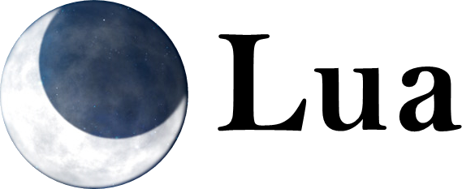

<p align="center">
  
</p>

## Sobre o Framework Lua

<p align="justify">
Lucas é um micro framework de aplicação web, que foi feito a partir do Slim Framework, ele é um framework gratuito e totalmente licenciado para ser distribuido modificado e até mesmo vendido, esta micro framework pode crescer e abrigar até aplicações complexas, sendo indicado até para o desenvolvimento de API's já que le irá totalmente pronto para realizar essa tarefa, a sintaxe dele é bem simples e elegante não tendo a necessidade nem de extender controllers.
</p>

## Documentação

<p align="justify">
Em poucos minutos qualquer pessoa que tenha um bom conhecimento em Orientação a Objetos e frameworks MVC vai entender como o framework funciona bem rápido, por enquanto ainda não temos uma documentação pronta, mas a própria documentação do Slim não funciona.
</p>

## Testes

Basta rodar o PHPUnit no projeto na linha de comando

```bash
$ phpunit
```

## Creditos

- [Lucas Lima](https://github.com/lucaslz)

## License
The Slim Framework is licensed under the MIT license. See [License File](LICENSE.md) File for more information.
